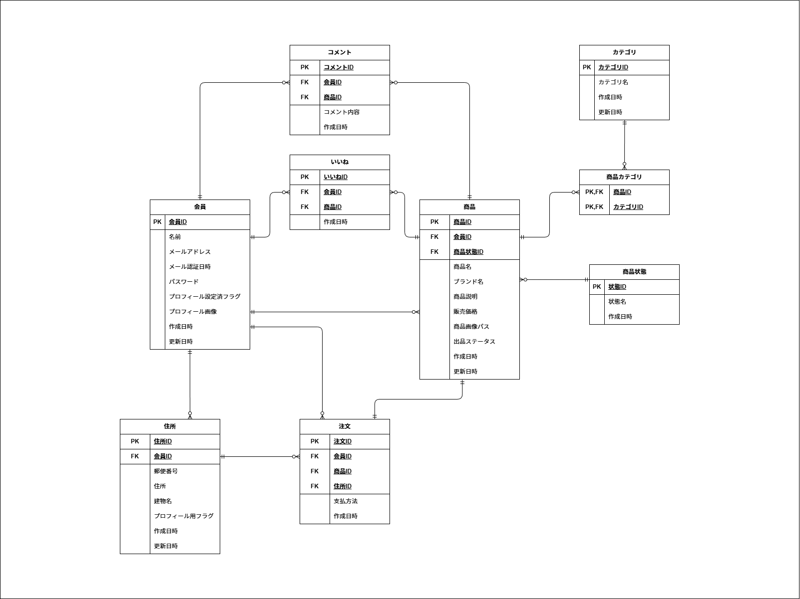

# COACHTECH模擬案件\_フリマアプリ

## 環境構築

### Dockerビルド

1. `git clone git@github.com:nom-wako/frima-app.git`
2. DockerDesktopアプリを立ち上げる
3. `docker-compose up -d --build`
   > MySQLは、MacのM1・M2チップのPCの場合、`no matching manifest for linux/arm64/v8 in the manifest list entries`のメッセージが表示されビルドができないことがあります。 エラーが発生する場合は、docker-compose.ymlファイルの「mysql」内に「platform」の項目を追加で記載してください

```
mysql:
    platform: linux/x86_64(この文追加)
    image: mysql:8.0.26
    environment:
```

### Laravel環境構築

1. `docker-compose exec php bash`
2. `composer install`
3. 「.env.example」ファイルを「.env」ファイルに命名を変更。または、新しく.envファイルを作成
4. .envに以下の環境変数を追加

```
DB_CONNECTION=mysql
DB_HOST=mysql
DB_PORT=3306
DB_DATABASE=laravel_db
DB_USERNAME=laravel_user
DB_PASSWORD=laravel_pass
```

5. アプリ―ケーションキーの作成

```
php artisan key:generate
```

6. マイグレーションの実行

```
php artisan migrate
```

7. シーディングの実行

```
php artisan db:seed
```

8. シンボリックリンク作成（画像表示用）

```
php artisan storage:link
```

## テスト実行手順

本プロジェクトではPHPUnitを使用して品質管理を行っています。

1. `docker-compose exec php bash`
2. `php artisan test`

## 使用技術（実行環境）

- PHP 8.1.34
- Laravel 8.83.29
- MySQL 8.0.26
- Stripe
- Mailhog

## ER図



## URL

- 開発環境：http://localhost
- phpMyAdmin：http://localhost:8080
- Mailhog：http://localhost:8025
